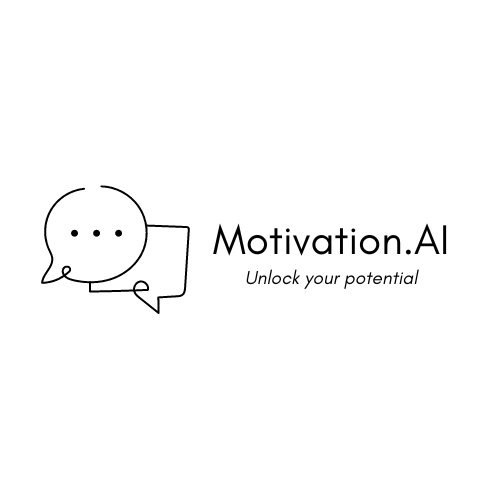

<br />
<div align="center">
  <a href="https://github.com/Hrishikesh332/Motivation.AI">
    
  </a>

  <h3 align="center">Motivation.ai</h3>

  <p align="center">
    Motivation.AI
    <br />
    <a href="https://github.com/Hrishikesh332/Motivation.AI"><strong>Explore the docs »</strong></a>
    <br />
    <br />
    <a href="https://github.com/Hrishikesh332/Motivation.AI">View Demo</a>
    ·
    <a href="https://github.com/Hrishikesh332/Motivation.AI/issues">Report Bug</a>
    ·
    <a href="https://github.com/Hrishikesh332/Motivation.AI/issues">Request Feature</a>
  </p>
</div>


## Do Check Out Motivation.AI 💪:

[](https://streamlit.app/)

<details>
  <summary>Table of Contents</summary>
  <ol>
    <li><a href="#About">About</a></li>
    <li><a href="#Features">Features</a></li>
    <li><a href="#Tech-Stack">Tech Stack</a></li>
    <li><a href="#Languages-and-Tools">Languages and Tools</a></li>
    <li><a href="#Instructions-on-running-project-locally">Instructions on running project locally</a></li>
    <li><a href="#Feedback">Feedback</a></li>


  </ol>
</details>

------

## About

Are you feeling lost, uninspired, or uncertain about your future and looking for some guidnance ? Do you wish you had someone wise and experienced to guide you through life's challenges and help you stay motivated on your path to the success? Look no further than Motivation.AI 💪

Motivation.AI is an AI-powered chat application that aims to serve the wisdom and inspiration of Dr. APJ Abdul Kalam to empower and guide the youth👨‍💻  With Motivation.AI, you can tap into the timeless teachings and uplifting messages of this great leader anytime, anywhere, and get the guidance and encouragement you need to keep moving forward and building word more better✨  So why wait? Start chatting with Motivation.AI today and unlock your full potential!

## Features

⭐ Chatbot responds as and reply with respective to the teachings, stories, and quotes of Dr. APJ Abdul Kalam, a respected leader and source of inspiration for many.

🤝 Chatbot can understand and respond to a wide range of questions and situations, and can provide personalized guidance and support to each user. It also helpful for youth to overcome common challenges and stay motivated on their path to success.

✔️ Provides insights into common challenges and concerns faced by youth, helps to overcome common challenges and stay motivated on their path to success, helping to inform and improve the application over time.


## Languages and Tools

<p align="left"> <a href="https://streamlit.io/" target="_blank" rel="noreferrer">  </a><a href="https://www.python.org/" rel="noreferrer">  </a>
<a href="https://openai.com/" rel="noreferrer">  </a>

 
 ## Instructions on running project locally:

Clone the project

```bash
  git clone https://github.com/Hrishikesh332/Motivation.AI.git
```

Install dependencies:

```bash
  pip install -r requirements.txt 
```
  

Run Project 

```bash
  streamlit run app.py
```


## Authors

🔆 [@Hrishikesh Yadav](https://www.github.com/hrishikesh332)

🔆 [@Shruti Mishra](https://github.com/ShrutiMishra-2002)


## Feedback

If you have any feedback, please reach out to us at **hrishikesh3321@gmail.com**


